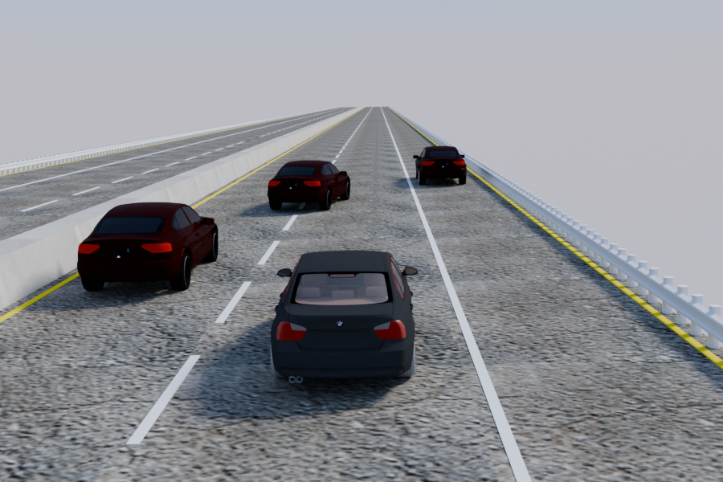
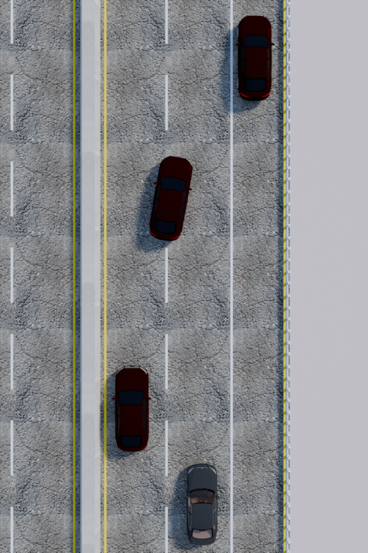

# Code and Reproducibity for the CCTA highway control problem
To conduct reproducibility study and facilitate future research, we open-sourced our simulation experiment result and code. Here are the instructure to run experiment.

## Install PyChrono as Simulation Engine 
You could install pychrono engine in your local computer in two methods:

(1) Use the `environment.yml` file in this directory and do the following step:
create a conda environment and install all necessary packages and libraries as listed in the `environment.yml`:
```bash
conda env create -f environment.yml
```
Then activate new environment, with name chrono:
```bash
conda activate chrono
```
Download pychrono using this link: https://anaconda.org/projectchrono/pychrono/9.0.0/download/linux-64/pychrono-9.0.0-py310_4853.tar.bz2 and install the downloaded package in the chrono environment:
```bash
conda insall <path_to_the_downloaded_file>.tar.bz2
```

(2) There are official pychrono download link available: https://api.projectchrono.org/pychrono_installation.html. And you will need to manually install the supporting packages like: torch, casadi, scipy, pandas, etc as suggested in the `environment.yml`.

## Run the Simulation Experiments
Two experiment described in the paper is presented as `exp1_straight_driving.py` and `exp2_complex_driving.py`. During our testing, a driving wheel is used as hardware. Considering driving simulator setup might be limited for most user, we decided to set `enable_joystick=False` as default. Following is the command to run experiment:
```bash
python exp1_straight_driving.py 
python exp2_complex_driving.py
```
The run time visualization aimed to achieve real-time and fast rendering for simulatio scene. We can post-process to experiment to obtain high-quality rendering for simulation experiments.

<!-- Display the two images side by side -->
<p align="center">
  
  
</p>
